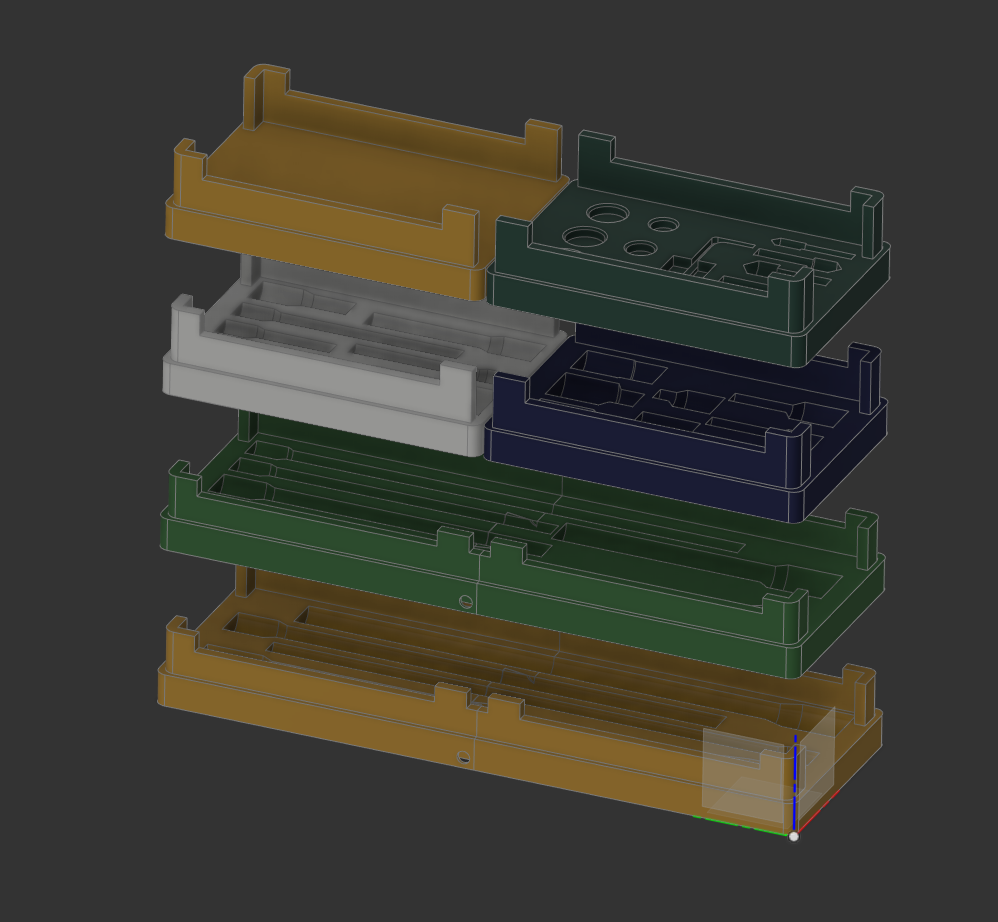
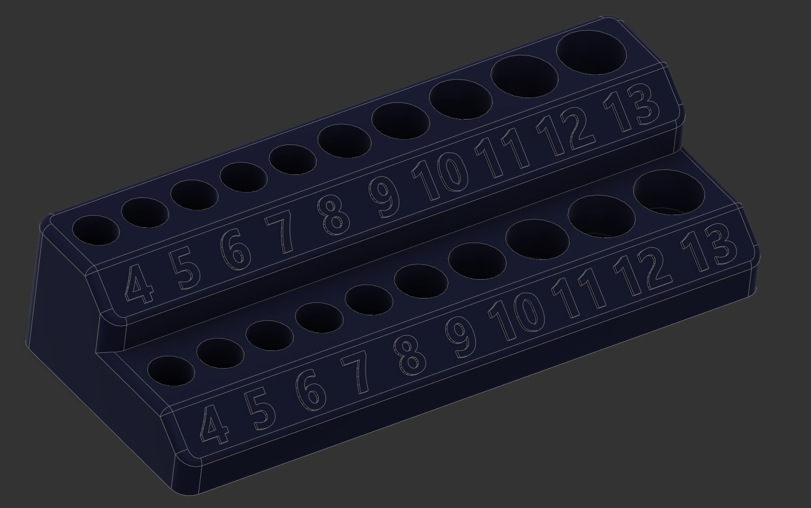
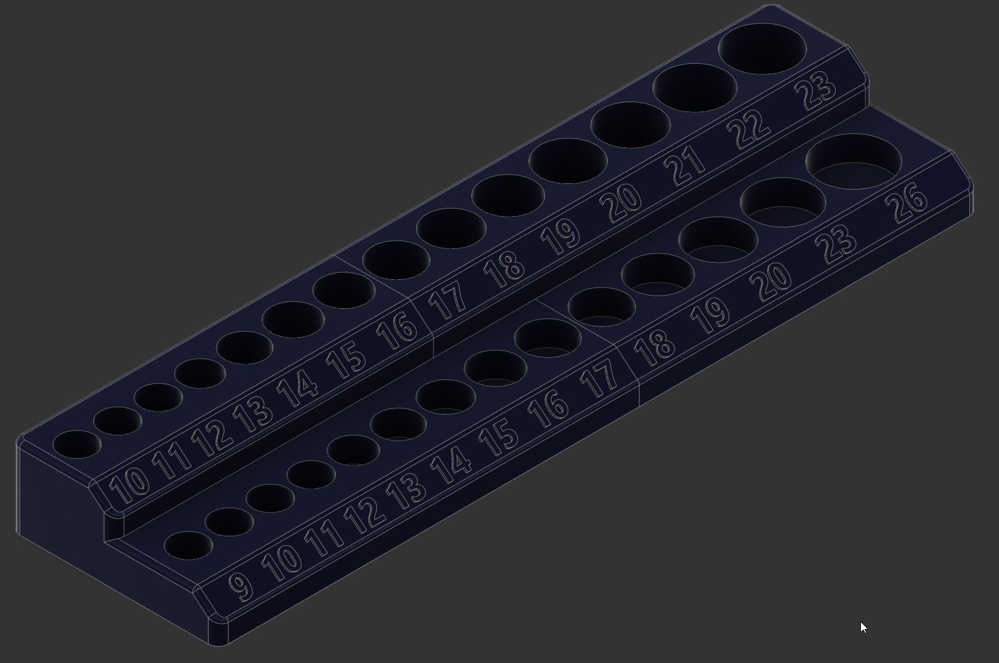
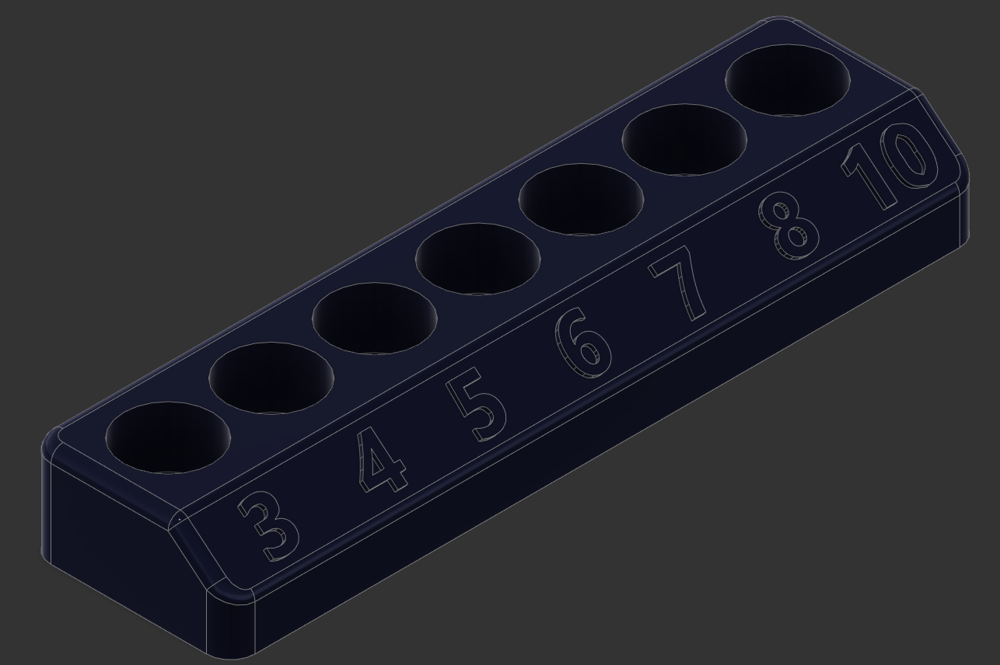
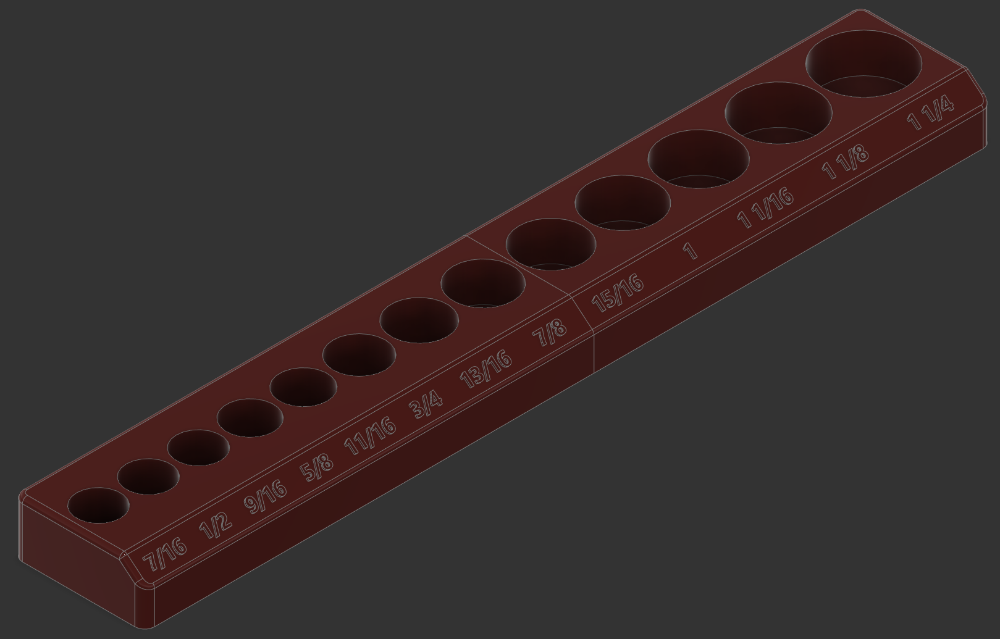
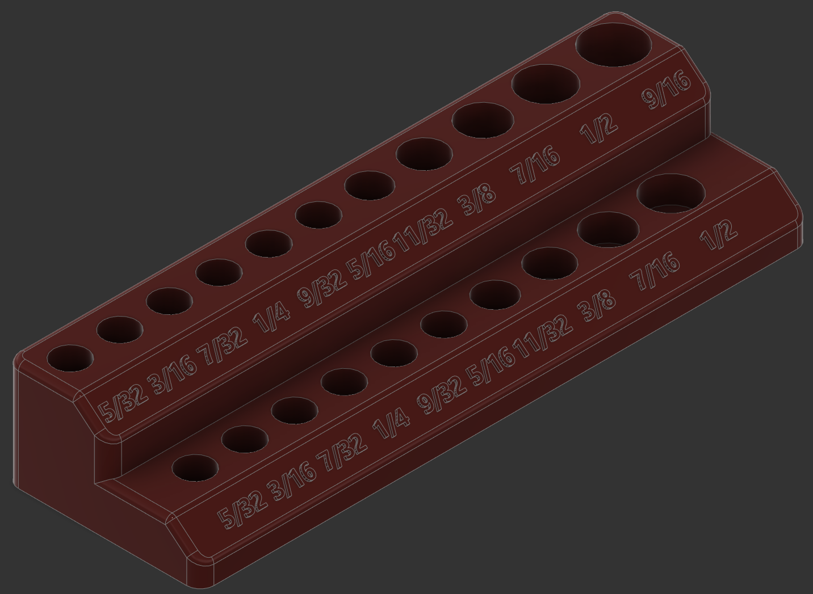
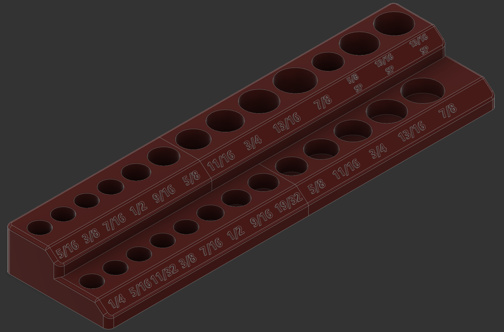
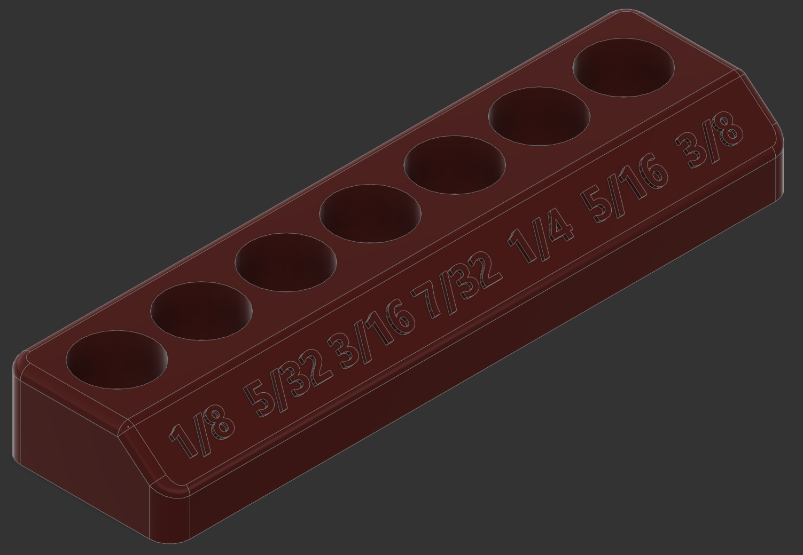

# Socket racks and extension trays

Saw this video and motivated me that I really wanted a 3d printer: https://youtu.be/NuV_B1_azJQ

Remix of: https://www.thingiverse.com/thing:4696546
Credit to [BuildBug](https://www.thingiverse.com/buildbug/designs) for concept

Used these magnets:
- [DIYMAG 2MM-Mix 100 Piece Refrigerator Magnets for Office, Hobbies, Crafts and Science, Round Ceramic Industrial Ferrite Magnets, Push Pin Magnets, Fridge Magnets, Whiteboard Magnets](https://smile.amazon.com/gp/product/B07MV6M12H/)
- [DIYMAG Refrigerator Magnets Premium Brushed Nickel Fridge Magnets, Office Magnets - 8 X 3 mm 100Piece](https://smile.amazon.com/gp/product/B07B3SDRCP/)
- [GBYMIUY Round Refrigerator Magnets, 100PCS 6×3MM Small Cylinder Fridge Magnets, Office Magnets, Whiteboard Magnets, Durable Mini Magnets](https://smile.amazon.com/gp/product/B07873ZCY4/)
- [DIYMAG Refrigerator Magnets Premium Brushed Nickel Fridge Magnets, Office Magnets - 12 X 2 mm 100Piece](https://smile.amazon.com/gp/product/B07GX7Z4DF/)

# Changelog

2021/03/22 - Commit after install and use

## Design

Autocad Fusion 360 

## Slicer

Ultimaker Cura 4.8.0
- Printer: Creality CR6 SE
- Layer Height: 0.2mm
- Infill Density: 20%
- Infill Pattern: Grid
- Filament: Inland PLA+ 1.75mm Purple, Red, Blue
- Material: PLA+
- Print Temperature: 215 degrees C
 
# Preview

